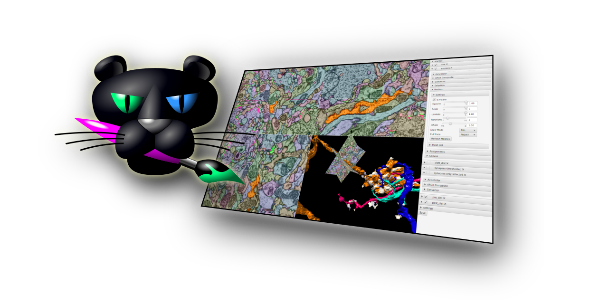
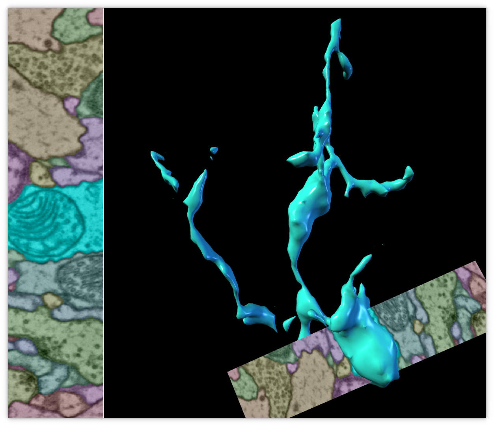
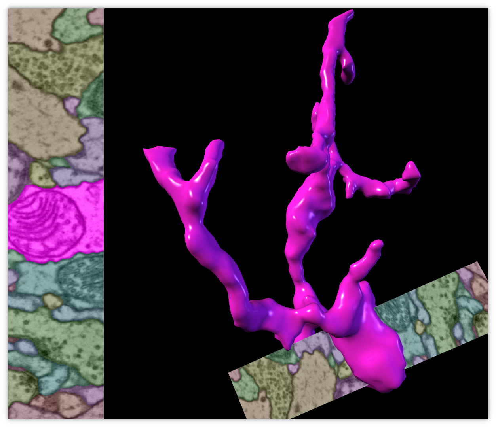
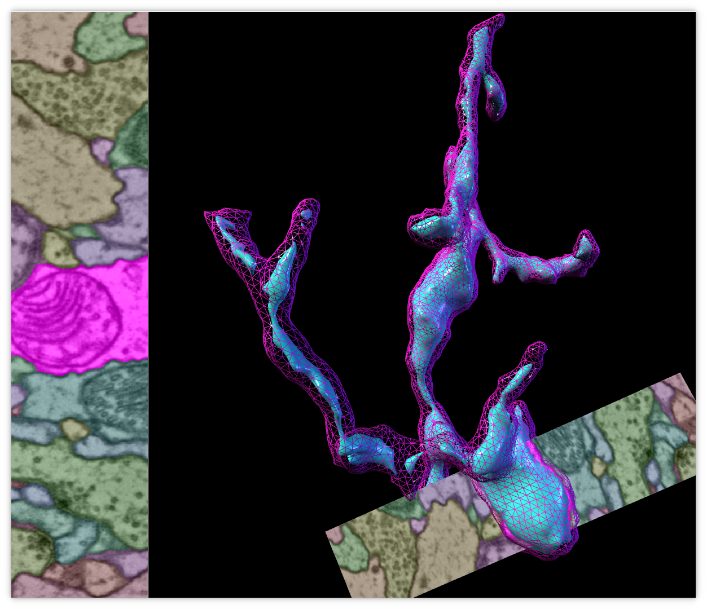

# Paintera  [](https://github.com/saalfeldlab/paintera/actions/workflows/build-main.yml)



Paintera is a general visualization tool for 3D volumetric data and proof-reading in segmentation/reconstruction with a primary focus on neuron reconstruction from [electron micrographs](http://www.rsc.org/publishing/journals/prospect/ontology.asp?id=CMO:0001800&MSID=B310802C) in [connectomics](https://en.wikipedia.org/wiki/Connectomics). It features/supports:
- [x] Views of orthogonal 2D cross-sections of the data at arbitrary angles and zoom levels
- [x] [Mipmaps](https://en.wikipedia.org/wiki/Mipmap) for efficient display of arbitrarily large data at arbitrary scale levels
- [x] Label data
  - [x] Painting
  - [x] Manual agglomeration
  - [x] 3D visualization as polygon meshes
    - [x] Meshes for each mipmap level
    - [x] Mesh generation on-the-fly via marching cubes to incorporate painted labels and agglomerations in 3D visualization. Marching Cubes is parallelized over small blocks. Only relevant blocks are considered (huge speed-up for sparse label data).
    - [x] Adaptive mesh details, i.e. only show high-resolution meshes for blocks that are closer to camera.

## Installation and Usage

Paintera is available for installation through [conda](#conda) and the [Python Package Index](#pip). If installing via [conda](#conda), dependencies are handled for you. When installing from [pip](#pip) it is necessary to install, Java 11 and Apache Maven. Efforts to create a standalone app have not been successful so far ([#253](https://github.com/saalfeldlab/paintera/issues/253)).

### Conda

Installation through conda requires an [installation of the conda package manager](https://docs.conda.io/projects/conda/en/latest/user-guide/install/).

Paintera installation requires an isolated conda environmet:
```sh
conda create --name paintera
conda activate paintera
```
Paintera is available for installation from the `conda-forge` channel:
```sh
conda install -c conda-forge paintera
```
For reasons that are not fully transparent to us at this time, conda may decide to install an outdated version of Paintera instead of the most recent one, you can fix this by updating Paintera:
```sh
conda update -c conda-forge paintera
```
Paintera can then be executed with the `paintera` command:
```
paintera [[JGO ARG... ][JVM ARG...] -- ][ARG...]
```
If you cannot see 3D rendering of objects or orthoslices, and Paintera floods the terminal with error messages like:
```sh
...
Feb 05, 2021 1:21:53 PM javafx.scene.shape.Mesh <init>
WARNING: System can't support ConditionalFeature.SCENE3D
...
```
please try to start it with forced GPU rendering:
```sh
paintera [JGO ARG... ][JVM ARG... ]-Dprism.forceGPU=true -- [ARG...]
```

### Dependencies

*Note* This section is not required if installing via [conda](#conda).

OpenJDK 11 and Maven are available through `conda-forge` channel on [conda](https://conda.io), respectively.
```sh
conda install -c conda-forge openjdk maven
```

Alternatively, you can install Java 11 and Maven manually. Java 11 (through [OpenJDK](https://openjdk.java.net/)) and Apache Maven are available for installation on many Linux distributions.

On Windows and macOS the use of [Oracle Java 11](https://www.oracle.com/java/technologies/javase-jdk11-downloads.html) is recommended and [Apache Maven needs to be downloaded and installed](https://maven.apache.org) manually. Make sure that both Java and Maven are available on the `PATH` after installation. Note that our experience with Windows and macOS installations is very limited and there may be better ways to install Java 11 and Maven on these operating systems. If you are aware of any, please create a pull request to add these to this README.

### Pip
Note: If installing via pip, it will be necessary to have Java 11 and Maven installed manually.

Paintera is [available on the Python Package Index](https://pypi.org/project/paintera) and can be installed through pip ([`Python >= 3.6`](https://www.python.org) required):
```sh
pip install paintera
```
Generally, it is advisable to install packages into user space with pip, i.e.
```sh
pip install --user paintera
```
On Linux, the packages will be installed into `$HOME/.local` and Paintera will be located at
```sh
$HOME/.local/bin/paintera
```
You can add `$HOME/.local/bin` to the `PATH` to make the `paintera` accessible from different locations.
Paintera can then be executed with the `paintera` command:
```
paintera [[JGO ARG...] [JVM ARG...] --] [ARG...]
```

We recommend setting these JVM options:

|Option| Description|
| ---- | ---------- |
| -Xmx16G | Maximum Java heap space (replace 16G with desired amount) |

## Running from source

Clone the paintera git repository:
```sh
git clone https://github.com/saalfeldlab/paintera.git
cd paintera
```

To run Paintera from source requires the dependencies listed in the above [dependencies](#Dependencies) section.

### Source Dependencies via sdkman

Alternatively, you can utilize [sdkman](https://sdkman.io/install) to manage the appropriate java version. Install sdkman as follows:

*Note*: If using windows, the following sdk commands must be run via either [WSL](https://docs.microsoft.com/en-us/windows/wsl/install-win10), [Cygwin](https://www.cygwin.com/install.html) or [Git Bash For Windows](https://git-scm.com/download/win). For Windows installation instructions, please follow the [Windows Installtion](https://sdkman.io/install) instructions.

```shell
curl -s "https://get.sdkman.io" | bash
source "$HOME/.sdkman/bin/sdkman-init.sh"
```

Once sdkman is installed, you can install the appropriate java version with:
```shell
sdk install java 11.0.10-open
```
`sdk` will then prompt whether to change to that version of java for your system default. If you say "No", then you will want to specify that you'd like to use Java 11 locally in your paintera directory. To do this, navigate to the `paintera` directory cloned in the above step, and execute:
```shell
sdk use java 11.0.10-open
# verify active version
sdk current java
```

Similarly, you can install maven via `sdkman` if you desire:
```shell
sdk install maven
```

### Running Paintera
To run paintera, execute the follow maven goal:
```sh
mvn javafx:run
```

## Display help message and command line parameters
The following assumes that Paintera was installed through [conda](#conda) or [pip](#pip) and the `paintera` command is available on the command line.
```shell
$ paintera --help
Usage: Paintera [--add-n5-container=<container>...
                [--add-n5-container=<container>...]... (-d=DATASET...
                [-d=DATASET...]... [-r=RESOLUTION] [-r=RESOLUTION]...
                [-o=OFFSET] [-o=OFFSET]... [-R] [--min=MIN] [--max=MAX]
                [--channel-dimension=CHANNEL_DIMENSION]
                [--channels=CHANNELS...] [--channels=CHANNELS...]...
                [--name=NAME] [--name=NAME]...
                [--id-service-fallback=ID_SERVICE_FALLBACK]
                [--label-block-lookup-fallback=LABEL_BLOCK_LOOKUP_FALLBACK]
                [--entire-container] [--exclude=EXCLUDE...]
                [--exclude=EXCLUDE...]... [--include=INCLUDE...]
                [--include=INCLUDE...]... [--only-explicitly-included])]...
                [-h] [--default-to-temp-directory] [--print-error-codes]
                [--version] [--height=HEIGHT]
                [--highest-screen-scale=HIGHEST_SCREEN_SCALE]
                [--num-screen-scales=NUM_SCREEN_SCALES]
                [--screen-scale-factor=SCREEN_SCALE_FACTOR] [--width=WIDTH]
                [--screen-scales=SCREEN_SCALES[,SCREEN_SCALES...]...]...
                [PROJECT]
      [PROJECT]              Optional project N5 root (N5 or FileSystem).
      --add-n5-container=<container>...
                             Container of dataset(s) to be added. If none is
                               provided, default to Paintera project (if any).
                               Currently N5 file system and HDF5 containers are
                               supported.
      --channel-dimension=CHANNEL_DIMENSION
                             Defines the dimension of a 4D dataset to be
                               interpreted as channel axis. 0 <=
                               CHANNEL_DIMENSION <= 3
                               Default: 3
      --channels=CHANNELS... Use only this subset of channels for channel (4D)
                               data. Multiple subsets can be specified. If no
                               channels are specified, use all channels.
  -d, --dataset=DATASET...   Dataset(s) within CONTAINER to be added. TODO: If
                               no datasets are specified, all datasets will be
                               added (or use a separate option for this).
      --default-to-temp-directory
                             Default to temporary directory instead of showing
                               dialog when PROJECT is not specified.
      --entire-container     If set to true, discover all datasets (Paintera
                               format, multi-scale group, and N5 dataset)
                               inside CONTAINER and add to Paintera. The -d,
                               --dataset and --name options will be ignored if
                               ENTIRE_CONTAINER is set. Datasets can be
                               excluded through the --exclude option. The
                               --include option overrides any exclusions.
      --exclude=EXCLUDE...   Exclude any data set that matches any of EXCLUDE
                               regex patterns.
  -h, --help                 Display this help message.
      --height=HEIGHT        Initial height of viewer. Defaults to 600.
                               Overrides height stored in project.
                               Default: -1
      --highest-screen-scale=HIGHEST_SCREEN_SCALE
                             Highest screen scale, restricted to the interval
                               (0,1], defaults to 1. If no scale option is
                               specified, scales default to [1.0, 0.5, 0.25,
                               0.125, 0.0625].
      --id-service-fallback=ID_SERVICE_FALLBACK
                             Set a fallback id service for scenarios in which
                               an id service is not provided by the data
                               backend, e.g. when no `maxId' attribute is
                               specified in an N5 dataset. Valid options are
                               (case insensitive): from-data — infer the max id
                               and id service from the dataset (may take a long
                               time for large datasets), none — do not use an
                               id service (requesting new ids will not be
                               possible), and ask — show a dialog to choose
                               between those two options
                               Default: ask
      --include=INCLUDE...   Include any data set that matches any of INCLUDE
                               regex patterns. Takes precedence over EXCLUDE.
      --label-block-lookup-fallback=LABEL_BLOCK_LOOKUP_FALLBACK
                             Set a fallback label block lookup for scenarios in
                               which a label block lookup is not provided by
                               the data backend. The label block lookup is used
                               to process only relevant data during on-the-fly
                               mesh generation. Valid options are: `complete' —
                               always process the entire dataset (slow for
                               large data), `none' — do not process at all (no
                               3D representations/meshes available), and `ask'
                               — show a dialog to choose between those two
                               options
                               Default: ask
      --max=MAX              Maximum value of contrast range for raw and
                               channel data.
      --min=MIN              Minimum value of contrast range for raw and
                               channel data.
      --name=NAME            Specify name for dataset(s). The names are
                               assigned to datasets in the same order as
                               specified. If more datasets than names are
                               specified, the remaining dataset names will
                               default to the last segment of the dataset path.
      --num-screen-scales=NUM_SCREEN_SCALES
                             Number of screen scales, defaults to 3. If no
                               scale option is specified, scales default to
                               [1.0, 0.5, 0.25, 0.125, 0.0625].
  -o, --offset=OFFSET        Spatial offset for all dataset(s) specified by
                               DATASET. Takes meta-data over resolution
                               specified in meta data of DATASET
      --only-explicitly-included
                             When this option is set, use only data sets that
                               were explicitly included via INCLUDE. Equivalent
                               to --exclude '.*'
      --print-error-codes    List all error codes and exit.
  -r, --resolution=RESOLUTION
                             Spatial resolution for all dataset(s) specified by
                               DATASET. Takes meta-data over resolution
                               specified in meta data of DATASET
  -R, --revert-array-attributes
                             Revert array attributes found in meta data of
                               attributes of DATASET. Does not affect any array
                               attributes set explicitly through the RESOLUTION
                               or OFFSET options.
      --screen-scale-factor=SCREEN_SCALE_FACTOR
                             Scalar value from the open interval (0,1) that
                               defines how screen scales diminish in each
                               dimension. Defaults to 0.5. If no scale option
                               is specified, scales default to [1.0, 0.5, 0.25,
                               0.125, 0.0625].
      --screen-scales=SCREEN_SCALES[,SCREEN_SCALES...]...
                             Explicitly set screen scales. Must be strictly
                               monotonically decreasing values in from the
                               interval (0,1]. Overrides all other screen scale
                               options. If no scale option is specified, scales
                               default to [1.0, 0.5, 0.25, 0.125, 0.0625].
      --version              Print version string and exit
      --width=WIDTH          Initial width of viewer. Defaults to 800.
                               Overrides width stored in project.
                               Default: -1
```

## Usage

| Action | Description |
| --------------- | ----------- |
| `P`               | Show Status bar on right side |
| (`Shift` +) `Ctrl` + `Tab` | Cycle current source forward (backward) |
| `Ctrl` + `O` | Show open dataset dialog |
| `M` | Maximize current view |
| `Shift` + `M` | Maximize split view of one slicing viewer and 3D scene |
| `Shift` + `Z` | Un-rotate but keep scale and translation |
| left click | toggle id under cursor if current source is label source (de-select all others) |
| right click / `Ctrl` left click | toggle id under cursor if current source is label source (append to current selection) |
| `Ctrl`+`A` | Select all ids |
| `Ctrl`+`Shift`+`A` | Select all ids in current view |
| `Shift` left click | Merge id under cursor with id that was last toggled active (if any) |
| `Shift` right click | Split id under cursor from id that was last toggled active (if any) |
| `Space` left click/drag | Paint with id that was last toggled active (if any) |
| `Space` right click/drag | Erase within canvas only |
| `Shift` + `Space` right click/drag | Paint background label |
| `Space` wheel | change brush size |
| `F` + left click | 2D Flood-fill in current viewer plane with id that was last toggled active (if any) |
| `Shift` + `F` + left click | Flood-fill with id that was last toggled active (if any) |
| `N` | Select new, previously unused id |
| `S` | Enter shape interpolation mode ( [Shape Interpolation Mode](#shape-interpolation-mode) ) |
| `Ctrl` + `C` | Show dialog to commit canvas and/or assignments |
| `C` | Increment ARGB stream seed by one |
| `Shift` + `C` | Decrement ARGB stream seed by one |
| `Ctrl` + `Shift` + `C` | Show ARGB stream seed spinner |
| `Ctrl` + `Enter` | Merge all selected ids |
| `V` | Toggle visibility of current source |
| `Shift` + `V` | Toggle visibility of not-selected ids in current source (if label source) |
| `R` | Clear mesh caches and refresh meshes (if current source is label source) |
| `L` | Lock last selected segment (if label source) |
| `Ctrl` + `S` | Save current project state. Note: This does not commit/persist canvas. Use the `commit canvas` dialog to persist any painted labels across sessions. |
| `Ctrl` + `Shift` + `N` | Create new label dataset |
| `B`  | Add bookmark with current global and 3D viewer transforms |
| `Shift` + `B` | Open dialog to add bookmark with text note |
| `Ctrl`+`B` | Open dialog to select bookmark |
| `Shortcut` + `Alt` + `T` | Open scripting REPL |

### Shape interpolation mode

| Action | Description |
| --------------- | ----------- |
| `1` / `2` | Edit first/last section when previewing interpolated shape |
| `Left Arrow` | `Right Arrow` | Edit the previous/next section when previewing interpolated shape
| `Enter` | Commit interpolated shape into canvas |
| `Esc` | Abort shape interpolation mode |

The mode is activated by pressing the `S` key when the current source is a label source. Then, you can select the objects in the sections by left/right clicking (scrolling automatically fixes the selection in the current section).

When you're done with selecting the objects in the second section and initiate scrolling, the preview of the interpolated shape will be displayed. If something is not right, you can edit the selection in the first or second section by pressing `1` or `2`, which will update the preview. When the desired result is reached, hit `Enter` to commit the results into the canvas and return back to normal mode.

While in the shape interpolation mode, at any point in time you can hit `Esc` to discard the current state and exit the mode.

## Supported Data

Paintera supports single and multi-channel raw data and label data from N5, HDF5, Zarr, AWS, and Google Cloud storage. The preferred format is the Paintera data format but regular single or multi-scale datasets can be imported as well. Any N5-like format can be converted into the preferred Paintera format with the [Paintera Conversion Helper](https://github.com/saalfeldlab/paintera-conversion-helper) that is automatically installed with Paintera from [conda](#conda) or [pip](#pip). For example, to convert raw and neuron_ids of the [padded sample A](https://cremi.org/static/data/sample_A_padded_20160501.hdf) of the [CREMI](https://cremi.org) challenge, simply run (assuming the data was downloaded into the current directory):
```sh
paintera-convert to-paintera \
  --scale 2,2,1 2,2,1 2,2,1 2 2 \
  --revert-array-attributes \
  --output-container=example.n5 \
  --container=sample_A_padded_20160501.hdf \
    -d volumes/raw \
      --target-dataset=volumes/raw2 \
      --dataset-scale 3,3,1 3,3,1 2 2 \
      --dataset-resolution 4,4,40.0 \
    -d volumes/labels/neuron_ids
```

Here,

- `--scale` specifies the number of downsampled mipmap levels, where each comma-separated triple specifies a downsampling factor relative to the previous level. The total number of levels in the mipmap pyramid is the number of specified factors plus one (the data at original resolution)
- `--revert-array-attributes` reverses array attributes like `"resolution"` and `"offset"` that may be available in the source datasets
- `--output-container` specifies the path to the output n5 container
- `--container` specifies the path to the input container
  - `-d` adds a input dataset for conversion
    - `--target-dataset` sets the name of the output dataset
    - `--dataset-scale` sets the scale of this dataset, overriding the global `--scale` parameter
    - `--dataset-resolution` sets the resolution of the dataset

Paintera Conversion Helper builds upon [Apache Spark](https://spark.apache.org) and can be run on any Spark Cluster, which is particularly useful for large data sets.

### Paintera Data Format

In [#61](https://github.com/saalfeldlab/paintera/issues/61) we introduced a specification for the preferred data format.

#### Raw

Accept any of these:

1. any regular (i.e. default mode) three-dimensional N5 dataset that is integer or float. Optional attributes are `"resolution": [x,y,z]` and `"offset": [x,y,z]`.
2. any multiscale N5 group that has `"multiScale" : true` attribute and contains three-dimensional multi-scale datasets `s0` ... `sN`. Optional attributes are `"resolution": [x,y,z]` and `"offset: [x,y,z]"`. In addition to the requirements from (1), all `s1` ... `sN` datasets must contain `"downsamplingFactors": [x,y,z]` entry (`s0` is exempt, will default to `[1.0, 1.0, 1.0]`). All datasets must have same type. Optional attributes from (1) will be ignored.
3. (preferred) any N5 group with attribute `"painteraData : {"type" : "raw"}` and a dataset/group `data` that conforms with (2).

#### Labels

Accept any of these:

1. any regular (i.e. default mode) integer or varlength `LabelMultisetType` (`"isLabelMultiset": true`) three-dimensional N5 dataset. Required attributes are `"maxId": <id>`. Optional attributes are `"resolution": [x,y,z]`, `"offset": [x,y,z]`.
2. any multiscale N5 group that has `"multiScale" : true` attribute and contains three-dimensional multi-scale datasets `s0` ... `sN`. Required attributes are `"maxId": <id>`. Optional attributes are `"resolution": [x,y,z]`, `"offset": [x,y,z]`, `"maxId": <id>`. If `"maxId"` is not specified, it is determined at start-up and added (this can be expensive). In addition to the requirements from (1), all `s1` ... `sN` datasets must contain `"downsamplingFactors": [x,y,z]` entry (`s0` is exempt, will default to `[1.0, 1.0, 1.0]`). All datasets must have same type. Optional attributes from (1) will be ignored.
3. (preferred) any N5 group with attribute `"painteraData : {"type" : "label"}` and a dataset/group `data` that conforms with (2). Required attributes are `"maxId": <id>`. Optional sub-groups are:

- `fragment-segment-assignment` -- Dataset to store fragment-segment lookup table. Can be empty or will be initialized empty if it does not exist.
- `label-to-block-mapping`      -- Multiscale directory tree with one text files per id mapping ids to containing label: `label-to-block-mapping/s<scale-level>/<id>`. If not present, no meshes will be generated.
- `unique-labels`               -- Multiscale N5 group holding unique label lists per block. If not present (or not using `N5FS`), meshes will not be updated when commiting canvas.

#### Label Multisets

Paintera uses mipmap pyramids for efficient visualization of large data: At each level of the pyramid, the level of detail (and hence the amount of data) is less than at the previous level. This means that less data needs to be loaded and processed if a lower level detail suffices, e.g. if zoomed out far. Mipmap pyramids are created by gradually downsampling the data starting at original resolution. Naturally, some information is lost at each level. In a naive approach of *winner-takes-all* downsampling, voxels at lower resolution are assigned the most frequent label id of all contributing voxels at higher resolution, e.g.

```
 _____ _____
|  1  |  2  |
|-----+-----|
|  2  |  3  |
 ‾‾‾‾‾ ‾‾‾‾‾
```

will be summarized into
```
 ___________
|           |
|     2     |
|           |
 ‾‾‾‾‾‾‾‾‾‾‾
```
As a result, label representation does not degenerate gracefully. This becomes obvious in particular when generating 3D representations from such data:

Mehses generated at lower resolution exhibit discontinuities. Instead, we propose the use of a non-scalar representation of multi-scale label data: [label multisets](https://github.com/saalfeldlab/imglib2-label-multisets). A summary of all contained labels is stored at each individual voxel instead of a single label. Each voxel contains a list of label ids and the associated counts:

| Label | Count |
| ----- | ----- |
| 1     | 2     |
| 3     | 1     |
| 391   | 5     |

The list is sorted by label id to enable efficient containment checks through binary search for arbitrary labels at each voxel. Going back to the simple example for winner-takes-all downsampling,
```
 _____ _____
| 1:1 | 2:1 |
|-----+-----|
| 2:1 | 3:1 |
 ‾‾‾‾‾ ‾‾‾‾‾
```

will be summarized into
```
 ___________
|    1:1    |
|    2:2    |
|    3:1    |
 ‾‾‾‾‾‾‾‾‾‾‾
```
As a result, label data generates gracefully and without discontinuities in 3D representation:

This becomes even more apparent when overlaying multiset downsampled labels (magenta) over winner-takes-all downsampled labels (cyan):


These lists can get very large at lower resolution (in the most extreme case, all label ids of a dataset are listed in a single voxel) and it can become necessary to sacrifice some accuracy for efficiency for sufficiently large datasets. The [`-m N1 N2 ...` flag of the Paintera conversion helper](#supported-data) restricts the list of a label multiset to the `N` most frequent labels if `N>0`. In general, it is recommended to specify `N=-1` for the first few mipmap levels and then gradually decrease accuracy at lower resolution levels.

#### Extracting Scalar Label Data From Paintera Dataset

Introduced in version `0.7.0` of the [`paintera-conversion-helper`](https://github.com/saalfeldlab/paintera-conversion-helper), the
```
extract-to-scalar
```
command extracts the highest resolution scale level of a Paintera dataset as a scalar `uint64`. Dataset. This is useful for using Paintera painted labels (and assignments) in downstream processing, e.g. classifier training. Optionally, the `fragment-segment-assignment` can be considered and additional assignments can be added (versions `0.8.0` and later). See `extract-to-scalar --help` for more details. The `paintera-conversion-helper` is installed with Paintera when installed through [conda](#conda) or [pip](#pip) but may need to be updated to support this feature.
